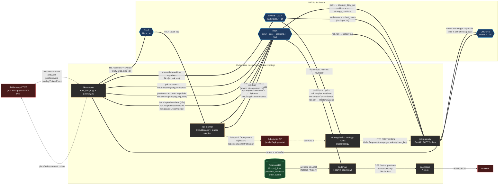

# TradeOps — Dataflow Diagram

Detaljeret diagram over NATS topics og dataflows mellem de forskellige services i TradeOps.

## Services

- `ibkr-adapter` — eneste service der taler med IB Gateway/TWS. Oversætter mellem `ib_insync`-events og NATS-meddelelser.
- `risk-gateway` — pre-trade gate. FastAPI med én write-endpoint (`POST /orders`).
- `risk-monitor` — post-trade circuit breaker med leader election + Kubernetes kill switch.
- `strategy-*` — trading-strategier som arver `BaseStrategy`. Modtager markedsdata, sender ordrer via HTTP.
- `api` — read-only FastAPI. Hybrid datakilde: in-memory NATS-cache for realtime + TimescaleDB for historik.
- `dashboard` — Next.js. Kun HTTP til API.

## NATS subject-hierarki

| Subject pattern | Producent | Subscribers | JetStream |
|---|---|---|---|
| `orders.<strategy>.<symbol>` | risk-gateway | ibkr-adapter (`orders.>`) | `ORDERS` (7d) |
| `fills.<account>.<symbol>` | ibkr-adapter | risk-monitor | `FILLS` (∞) |
| `pnl.<account>` | ibkr-adapter | risk-monitor, risk-gateway, api | `RISK` (30d) |
| `positions.<account>.<symbol>` | ibkr-adapter | risk-monitor, risk-gateway, api | `RISK` (30d) |
| `marketdata.realtime.<symbol>` | ibkr-adapter | strategies, risk-gateway | `MARKETDATA` (1h) |
| `risk.adapter.heartbeat` | ibkr-adapter | risk-monitor, api | `RISK` |
| `risk.adapter.disconnected` | ibkr-adapter | risk-monitor, api | `RISK` |
| `risk.adapter.reconnected` | ibkr-adapter | risk-monitor | `RISK` |
| `risk.halt` | risk-monitor | risk-gateway, api | `RISK` |

## Diagram

## Detaljerede dataflows

### 1. Order-flow (happy path)
Strategy beslutter (i `on_bar`) → `POST /orders` → `CheckEngine.check()` kører 9 fail-fast checks (`risk-gateway/src/risk_gateway/checks.py:70-80`) → ved success publiceres på `orders.<strategy>.<symbol>` → ibkr-adapter dekoder `OrderCommand`, kalder `place_order()` på `ib_insync` → TWS executes → `execDetailsEvent` → publiceres som `fills.<account>.<symbol>`.

### 2. State-feedback til risk-gateway
`pnl.>`, `positions.>`, `marketdata.>` fra ibkr-adapter opdaterer `CheckEngine.strategy_daily_pnl`, `strategy_positions`, og `last_prices` (`risk-gateway/src/risk_gateway/nats_sync.py:56-92`). Det er disse caches der bagefter tjekker daily-loss, position-limit og fat-finger på næste indkommende ordre.

### 3. Kill switch
risk-monitor leader-pod evaluerer `AccountState` mod thresholds (`risk-monitor/src/risk_monitor/circuit_breaker.py:40-91`) → ved breach: scaler alle deployments med label `app.kubernetes.io/component=strategy` til 0 replicas via Kubernetes API (`risk-monitor/src/risk_monitor/kill_switch.py:78-107`) + publicerer `risk.halt`. risk-gateway lytter på `risk.halt` og afviser efterfølgende ordrer (`risk-gateway/src/risk_gateway/checks.py:86-88`).

### 4. API hybrid-cache
`RealtimeCache` holder seneste position/PnL/halt-status i hukommelse (`api/src/trader_api/realtime.py:20-30`). Endpoints falder først tilbage til TimescaleDB hvis cachen er tom (`api/src/trader_api/app.py:62-68`).

## Vigtige observationer

- **Ingen anden service end ibkr-adapter har en TWS-forbindelse** — det er bevidst single-writer for at undgå dobbelte ordre-reservationer per `clientId`.
- **Adapter er stateless ift. NATS** — alle TWS-events oversættes 1:1 til pydantic-modeller og publiceres. Persistens er ned-streams ansvar.
- **JetStream er "best effort"** for adapter: hvis JS-publish fejler, falder den tilbage til core NATS (`ibkr-adapter/src/ibkr_adapter/nats_bridge.py:65-78`).
- **Risk-gateway og risk-monitor er to forskellige forsvarslag:** gateway = preventive (afvis ordre før send), monitor = corrective (sluk strategier efter tab).
- **TimescaleDB-skriverhuller:** `fills`, `pnl_ticks`, etc. defineres i schemaet og læses af API, men ingen service i repoet skriver til dem pt. — det er en åben ende.
