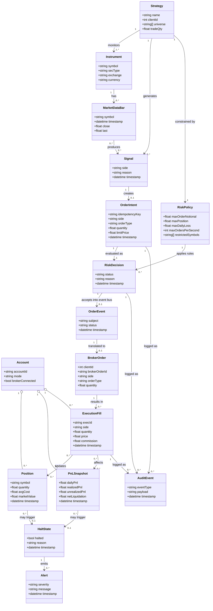

# Domaenemodel for AmalieTrader

## Formaal

Domaenemodellen beskriver de centrale begreber i AmalieTrader og deres relationer. Modellen fokuserer paa projektets forretningsdomaene: algoritmisk handel, risikostyring, ordreflow, broker-integration og overvagning. Den beskriver ikke Kubernetes, Docker, Helm eller andre tekniske deployment-detaljer, da de hoerer til den tekniske arkitektur.

## Centrale domaenebegreber

| Begreb | Beskrivelse |
| --- | --- |
| Account | En Interactive Brokers-konto, som strategier handler paa. Kontoen har positioner, PnL og broker-status. |
| Strategy | En handelsstrategi, der analyserer markedsdata og genererer ordreintentioner. |
| Instrument | Et finansielt instrument, fx AAPL, som kan handles. |
| MarketDataBar | En prisobservation for et instrument, fx close/last price. |
| Signal | Strategiens beslutningsgrundlag, fx BUY eller SELL ud fra moving average crossover. |
| OrderIntent | En ordreintention fra en strategi, inden den er godkendt af risikostyringen. |
| RiskPolicy | Regler for hvad en strategi maa handle, fx max order notional, max position og rate limit. |
| RiskDecision | Resultatet af Risk Gatewayens vurdering: accepted eller rejected. |
| OrderEvent | En accepteret ordre, der publiceres videre i systemet. |
| BrokerOrder | Den ordre, som adapteren omsaetter til Interactive Brokers API-format. |
| ExecutionFill | En faktisk handel eller delhandel rapporteret tilbage fra broker. |
| Position | Aktuel beholdning i et instrument paa kontoen. |
| PnLSnapshot | Ojebliksbillede af profit/loss for kontoen. |
| HaltState | Circuit breaker-tilstand, hvor systemet kan stoppe nye ordrer. |
| Alert | En advarsel om fx heartbeat timeout, drawdown eller anden risikohaendelse. |
| AuditEvent | Sporbar historik over beslutninger, ordrer og broker-events. |

## Mermaid class diagram

## Forklaring af relationerne

En Strategy overvager et eller flere Instruments gennem MarketDataBars. Naar strategien ser et handelsmoenster, fx et moving average crossover, opretter den et Signal. Signalet kan foere til en OrderIntent, som beskriver strategiens oenske om at koebe eller saelge.

OrderIntent sendes ikke direkte til broker. Den vurderes foerst mod en RiskPolicy i Risk Gateway. Resultatet er en RiskDecision. Hvis beslutningen er rejected, stoppes flowet, og afvisningen kan gemmes som AuditEvent. Hvis beslutningen er accepted, bliver ordreintentionen til et OrderEvent paa eventbussen.

IBKR-adapteren omsaetter et OrderEvent til en BrokerOrder. BrokerOrder sendes til Interactive Brokers, som returnerer ExecutionFills, positioner og PnL. Disse data opdaterer Account-tilstanden og goer det muligt for dashboard, API og risk-monitor at vise systemets aktuelle status.

Risk-monitor vurderer PnLSnapshots, Positions og adapter heartbeat. Hvis risikoen bliver for hoej, kan systemet oprette en HaltState og sende Alerts. HaltState bruges af Risk Gateway til at blokere nye ordreintentioner.

## Afgrænsning

Modellen viser ikke tekniske infrastrukturbegreber som Pod, Deployment, Service, Helm chart, Docker image, NATS subject eller database-tabel som selvstaendige domaeneobjekter. De er vigtige i implementeringen, men de er tekniske realiseringer af domaenebegreberne, ikke selve handelsdomaenet.

