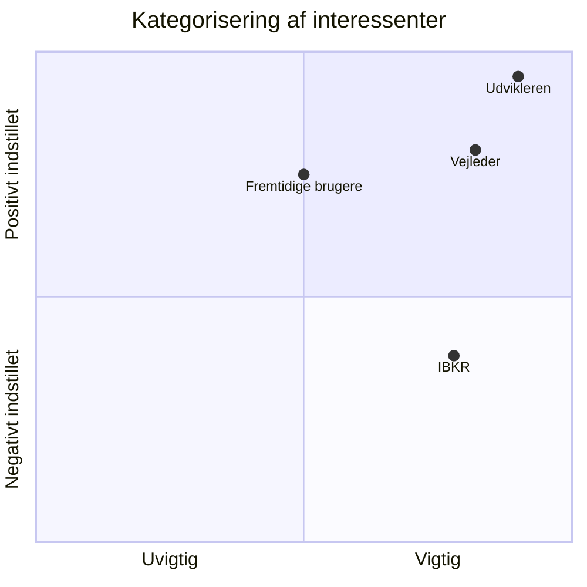

# Interessentanalyse

**Interessenter:**
- Udvikleren
- Vejleder
- Interactive Brokers (IBKR)
- Potentielle fremtidige brugere

For at identificere nøgleinteressenter for projektet kategoriserer vi de forskellige interessenter i forhold til deres indstilling og indflydelse for projektets succes.

Udfra denne kategorisering, er det herefter muligt at identificere nøgleinteressenter, som har følgende succeskriterier:

**Udvikleren:**
- Et velfungerende teknisk produkt inden for deadline.
- Klare krav og afgrænsninger fra start.
- Løbende refleksion over tekniske valg.
- Produktet afspejler kompetencer fra uddannelsen på en faglig tilfredsstillende måde.

**Vejleder:**
- Opfylde minimumskrav for projektet.
- Produkt som fremviser den studerendes udvikling som datamatiker.
- Fungerende produkt med faglig dybde og refleksion.
- Rapporten er velstruktureret og dækker de relevante fagområder.

**Interactive Brokers (IBKR):**
- Platformen overholder IBKR's API-betingelser og tekniske begrænsninger.
- Systemet misbruger ikke paper trading-miljøet eller gateway-infrastrukturen.

**Potentielle fremtidige brugere:**
- En platform der er reproducerbar og forståelig uden forudgående kendskab til broker-integration.
- Tydelig adskillelse mellem strategi og broker.
- Lav barriere for at sætte systemet op via Helm/Kubernetes.

Der kan nu opstilles en tabel over de valgte nøgleinteressenter, således at der kan dannes et overblik over deres indvirkning på projektet. Tabellen skal bruges som et referencepunkt for, hvornår nøgleinteressenter skal informeres om forskellige ændringer i forhold til projektet.

---

| **Interessenter** | **Deres mål** | **Tidligere reaktion** | **Hvad der kan forventes** | **Indvirkning positive/negativ** | **Mulig fremtidig reaktion** | **Ideer** |
|---|---|---|---|---|---|---|
| Udvikleren | Velfungerende platform der demonstrerer datamatikerkompetencer. Klare tekniske valg og reproducerbar deployment. | Høje ambitioner for arkitektur med stærkt fokus på sikkerhed og separation of concerns. | Opsøgende og motiveret. Iterativ udvikling via Kanban. Løbende refleksion og dokumentation af tekniske valg. | Direkte og afgørende for projektets succes. God arbejdsindsats hæver kvalitet og antal features. Dårlig prioritering kan resultere i ufærdigt produkt ved deadline. | Kan blive presset på tid ved uventet kompleksitet i IBKR-integration eller Kubernetes-deployment. | Prioriter MoSCoW-krav stramt. Brug Kanban-board aktivt. Skriv rapporten løbende frem for til sidst. |
| Vejleder | Guide den studerende til et velfungerende produkt som opfylder eksamenskrav og demonstrerer faglig progression. | Positiv over projektemne. Opmærksom på risiko for overkompleksitet i enkeltmandsprojekt. | Løbende feedback på arkitekturvalg, rapportstruktur og afgrænsning. | Kan forme produktets fokus og afgrænsning indirekte. Positiv indvirkning ved klar kommunikation og hyppige check-ins. | Kan anbefale yderligere afgrænsning eller dybere dokumentation af specifikke tekniske valg. | Involver vejleder tidligt ved tvivl om scope. Afklar forventninger til rapportens faglige niveau og produktets omfang. |
| Interactive Brokers (IBKR) | At API og paper trading-infrastruktur bruges inden for gældende vilkår og tekniske begrænsninger. | Ingen direkte kontakt. IBKR's gateway-model og pacing-regler sætter tekniske rammer for hele platformens design fra starten. | Stabil API-adgang til paper trading. IBKR er ikke en aktiv samarbejdspartner, men en teknisk forudsætning. | Tekniske begrænsninger (pacing, reconnects, klientID, daglig restart) er direkte negative bindinger. Paper trading-miljøet er positivt for sikker test uden reelle tab. | Kan indføre API-ændringer eller gateway-opdateringer der kræver tilpasning i platformen. | Dokumentér IBKR's tekniske begrænsninger tydeligt i rapporten. Byg systemet til at håndtere reconnects og pacing-fejl som kendte driftsscenarier. |
| Potentielle fremtidige brugere | En reproducerbar platform til test af handelsalgoritmer uden at bygge et usikkert trading setup fra bunden. | Ikke involveret i første version. Platformen bygges primært til intern test og dokumentation af teknisk gennemførlighed. | Teknisk interesse i løsningen som fundament for videreudvikling. Fokus på dokumentation, opsætning og reproducerbarhed. | Kan validere og styrke tekniske valg positivt ved interesse. Kan efterspørge brugergrænseflade og onboarding-dokumentation der ligger uden for projektets scope. | Kan efterspørge bedre opsætningsvejledning, UI-forbedringer og udvidelse til andre brokers. | Skriv tydelig README og Helm-deployment dokumentation. Dokumenter paper-til-live-skift som en konkret fremtidig udvidelse i perspektiveringen. |
