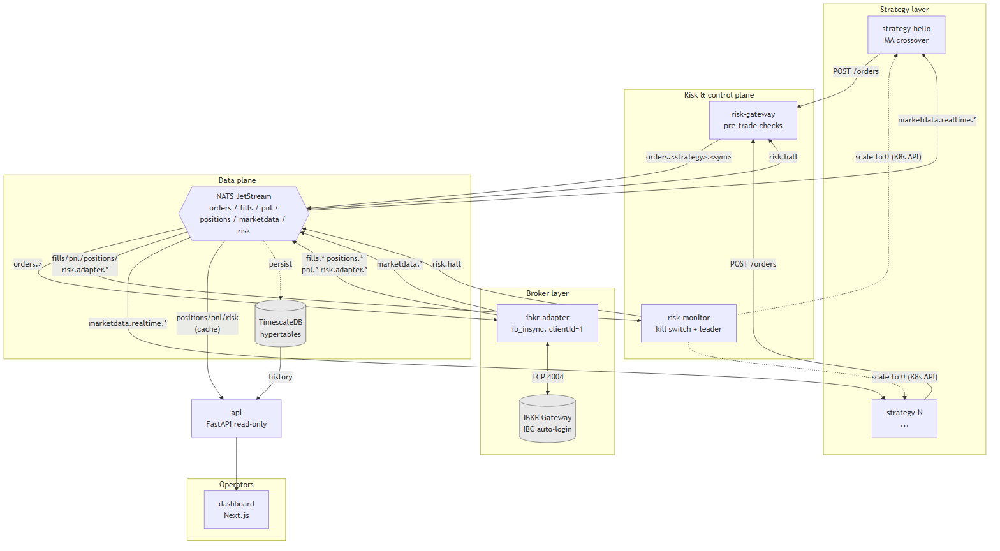

# AmalieTrader Codebase Overview

AmalieTrader is a multi-service trading platform built around a single Interactive Brokers account and a single IBKR Gateway session. The repository contains Python backend services, a Next.js dashboard, Docker packaging for each service, and a Helm chart that deploys the full topology to Kubernetes.

The core runtime path is:

```text
strategy pod -> risk-gateway -> NATS orders.* -> ibkr-adapter -> IBKR Gateway
IBKR callbacks -> ibkr-adapter -> NATS fills/positions/pnl/risk -> API, risk-monitor, dashboard
```

## Repository Layout

```text
.
|-- build-and-push.ps1
|-- helm/
|   `-- ibkrtrader/
|       |-- Chart.yaml
|       |-- values.yaml
|       |-- values.paper.yaml
|       |-- values.live.yaml
|       |-- values.schema.json
|       |-- ARCHITECTURE.md
|       |-- templates/
|       `-- charts/
`-- services/
    |-- api/
    |-- dashboard/
    |-- ibkr-adapter/
    |-- risk-gateway/
    |-- risk-monitor/
    `-- strategy-hello/
```

## Service Descriptions

### `strategy-hello` — example strategy
Python 3.12 service implementing a simple moving-average crossover.

- **Listens to**: `marketdata.realtime.<symbol>` on NATS
- **Sends**: `POST /orders` to risk-gateway over HTTP
- **Config**: universe (symbols), fast/slow MA periods, trade quantity
- **Pattern**: inherits from `BaseStrategy` — new strategies only need to implement `on_bar()`

### `risk-gateway` — pre-trade gate
FastAPI service. Every strategy order must pass through here before it can reach the broker.

- **HTTP**: `POST /orders` validates and returns `accepted` / `rejected` with a structured reason
- **Publishes**: accepted orders on `orders.<strategy>.<symbol>` (NATS)
- **Subscribes to**: `pnl.>`, `positions.>`, `marketdata.>`, `risk.halt` for state used in checks
- **Checks**: global halt, restricted symbols, fat-finger limit-price band, per-strategy max order notional, per-strategy daily loss, position limit, rate limits (per-strategy and global), idempotency-key duplicates
- **Limitation**: check state is in-memory — multiple replicas do not share state

### `ibkr-adapter` — broker bridge
Python service that owns the broker connection. The only service that talks directly to IBKR Gateway.

- **Subscribes to**: `orders.>` on NATS
- **Talks to**: IBKR Gateway over TCP via `ib_insync`, with reserved client ID `1`
- **Publishes**: `fills.<account>.<symbol>`, `positions.<account>.<symbol>`, `pnl.<account>`, `risk.adapter.heartbeat`, `risk.adapter.disconnected`, `risk.adapter.reconnected`
- **Exposes**: health endpoints and Prometheus metrics

### `risk-monitor` — out-of-band portfolio guard
Python service that watches the whole account and can trip a kill switch.

- **Subscribes to**: `fills.>`, `pnl.>`, `positions.>`, `risk.adapter.*`
- **Publishes**: `risk.halt` on threshold breach
- **Actions**: can scale strategy Deployments to zero via Kubernetes API (RBAC), sends Telegram alerts
- **HA**: Kubernetes Lease-based leader election — only one replica acts at a time
- **Thresholds**: max daily loss, max drawdown percent, max gross exposure, adapter heartbeat timeout

### `api` — read-only HTTP backend
FastAPI service serving the dashboard and operators.

- **Routes**: `/status`, `/positions`, `/pnl`, `/pnl/history`, `/fills`, `/orders`, `/healthz`, `/readyz`
- **Subscribes to**: `positions.>`, `pnl.>`, `risk.>` for a low-latency in-memory cache
- **Reads from**: TimescaleDB for history (`/pnl/history`, `/fills`)

### `dashboard` — operator UI
Next.js 14 with React, SWR, Tailwind, and Recharts.

- **Calls**: the `api` service through `NEXT_PUBLIC_API_URL`
- **Polling**: SWR every 10 seconds (not server-sent events)
- **Shows**: system/account status, daily/realized/unrealized/net-liquidation PnL, PnL history chart, open positions, recent fills

### Infrastructure (deployed by Helm)

- **IBKR Gateway** (`ghcr.io/gnzsnz/ib-gateway:stable`) — StatefulSet with IBC auto-login from a Kubernetes Secret. Exposes port 4004 (paper) or 4001 (live), and VNC on 5900.
- **NATS + JetStream** — event bus between all services.
- **TimescaleDB** (CloudNativePG) — hypertables: `fills`, `pnl_ticks`, `positions_snapshot`, `order_events`, `marketdata_bars`; continuous aggregate `pnl_1min`.

## Service Diagram



### How to read the diagram

- **Solid arrows** = primary message flow (orders out, callbacks in)
- **Dashed arrows** = infrequent or asynchronous paths (halt, persistence, scale-to-zero)
- **NATS is the hub** — almost all inter-service communication goes through it; only strategy → risk-gateway and dashboard → api are HTTP
- **`ibkr-adapter` is the only pod that talks to IBKR** — one clean broker boundary; strategies don't need to know about `ib_insync`
- **`risk-gateway` and `risk-monitor` are two defence layers** — gateway stops bad single orders before they leave; monitor halts the whole system if aggregate risk is breached

## Data Plane

### NATS subjects

| Subject | Direction |
|---|---|
| `orders.<strategy>.<symbol>` | risk-gateway → adapter |
| `fills.<account>.<symbol>` | adapter → risk-monitor, api |
| `positions.<account>.<symbol>` | adapter → risk-monitor, api |
| `pnl.<account>` | adapter → risk-monitor, api |
| `marketdata.realtime.<symbol>` | (adapter →) strategies |
| `risk.adapter.heartbeat` | adapter → risk-monitor |
| `risk.adapter.disconnected` / `.reconnected` | adapter → risk-monitor |
| `risk.halt` | risk-monitor → all |

JetStream stream templates are bundled in the chart and disabled by default via `jetstreamStreams.enabled`.

### TimescaleDB schema

Migrations live in `services/api/db/migrations/001_initial_schema.sql`.

Tables / hypertables:
- `fills`
- `pnl_ticks`
- `positions_snapshot`
- `order_events`
- `marketdata_bars`

Plus a continuous aggregate `pnl_1min` for chart-friendly one-minute PnL data.

## Kubernetes and Helm

The Helm chart under `helm/ibkrtrader` deploys:

- IBKR Gateway StatefulSet and Service
- IBKR adapter Deployment
- One strategy Deployment per item in `values.yaml` under `strategies`
- Risk gateway Deployment
- Risk monitor Deployment and RBAC
- API Deployment
- Dashboard Deployment
- CloudNativePG/Timescale cluster resources
- NATS dependency chart
- Optional ServiceMonitor resources

Defaults target paper trading. `values.paper.yaml` and `values.live.yaml` provide environment-specific overrides.

Chart conventions:
- `ibkr.mode` selects paper or live gateway routing
- `ibkrAdapter.clientId` reserves client ID `1`
- Each strategy must have a unique `clientId`
- Images default to `ghcr.io/amaliecjensen/ibkrtrader/<service>:v0`
- IBKR credentials are expected through an existing Kubernetes Secret by default

## Build and Deployment

`build-and-push.ps1` builds and pushes all service images:

```powershell
.\build-and-push.ps1 -GithubUser <github-user> -Tag v0
```

Services built by the script: `ibkr-adapter`, `risk-monitor`, `risk-gateway`, `api`, `strategy-hello`, `dashboard`.

Images are pushed to:

```text
ghcr.io/<github-user>/ibkrtrader/<service>:<tag>
```

Install via Helm:

```powershell
helm install trader ./helm/ibkrtrader -f helm/ibkrtrader/values.paper.yaml -n trading --set global.imageRegistry=ghcr.io/<github-user>
```

## Configuration Model

Python services use `pydantic-settings` and are configured primarily through environment variables injected by Helm.

Common settings:
- `NATS_URL`
- `IBKR_ACCOUNT`
- `IBKR_MODE`
- `LOG_LEVEL`
- `LOG_FORMAT`
- `HEALTH_PORT`
- `METRICS_PORT`

Service-specific settings include:
- IBKR adapter: `IBGW_HOST`, `IBGW_PORT`, `IBKR_CLIENT_ID`, reconnect settings
- Risk gateway: global risk limits, restricted symbols, `STRATEGY_LIMITS_JSON`
- Risk monitor: drawdown/loss/exposure thresholds, Telegram settings, Kubernetes namespace/release, leader election timings
- Strategy: strategy name, universe, MA periods, trade quantity, risk gateway URL
- API: Postgres host/port/database/user/password
- Dashboard: `NEXT_PUBLIC_API_URL`

## Testing

Python services use pytest through Hatch environments. Coverage exists for:

- `ibkr-adapter`: models and NATS bridge behavior
- `risk-gateway`: risk checks
- `risk-monitor`: account state and circuit-breaker behavior
- `strategy-hello`: strategy behavior

The dashboard has npm scripts for development, build, start, and lint.

Typical local commands by service:

```powershell
cd services\risk-gateway
hatch run pytest
```

```powershell
cd services\dashboard
npm run build
```

## Current Implementation Notes

- The architecture document in `helm/ibkrtrader/ARCHITECTURE.md` is more aspirational and detailed than some current service implementations.
- The codebase is in a v0-style state: the topology is present, but some production-hardening pieces still need externalized state, stricter network policy, complete reconciliation, persistent audit writes from all event paths, and operational secrets management.
- Risk gateway state is currently in-memory, which matters if running the configured two replicas.
- The dashboard polls the API with SWR every 10 seconds rather than using server-sent events.
- The strategy example is intentionally simple and intended as a template for new strategy services.
- The repo includes vendored Helm chart dependencies under `helm/ibkrtrader/charts`.

## High-Level Mental Model

Strategies generate intent, the risk gateway decides whether that intent may enter the system, NATS carries accepted commands and broker events, the IBKR adapter owns broker I/O, the risk monitor watches the whole account for emergent breaches, TimescaleDB stores history, and the API/dashboard expose read-only operational visibility.

